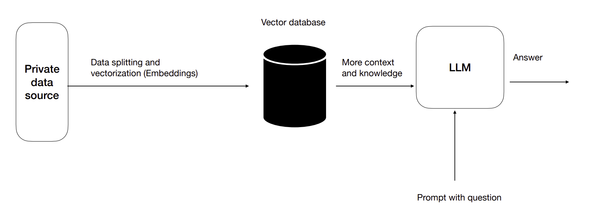
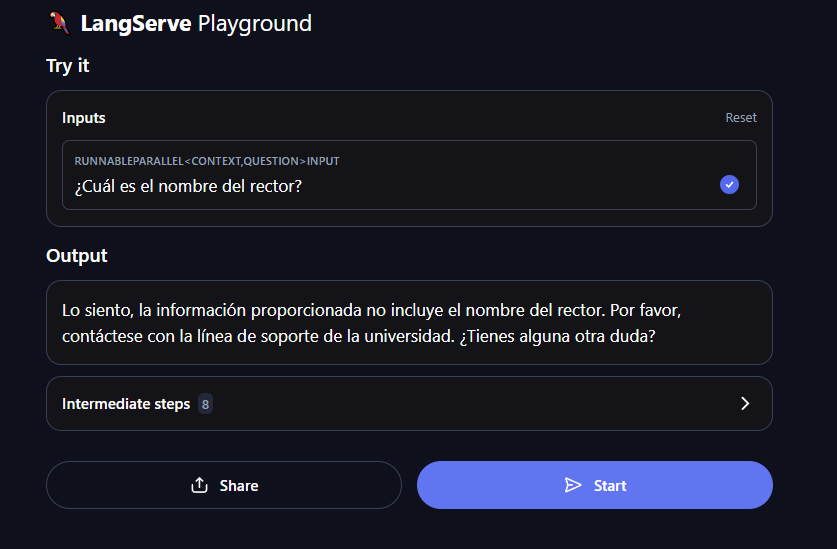
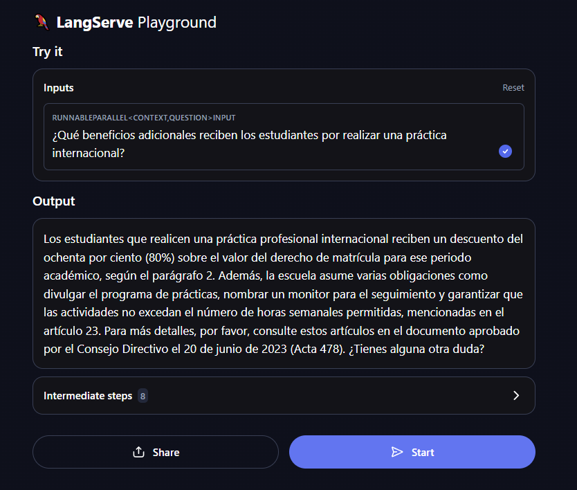
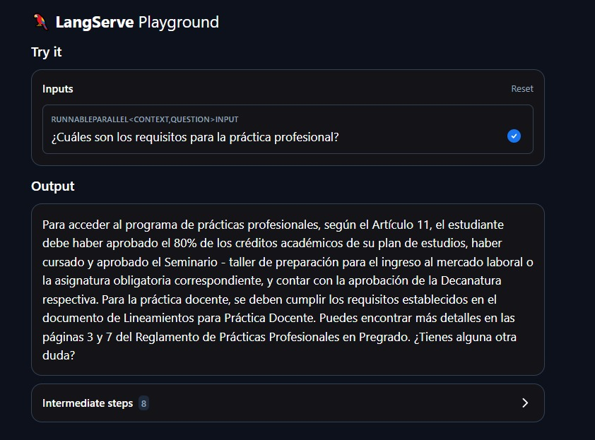

# TallerRagProject

El objetivo de este taller es implementar una arquitectura **RAG (Retrieval-Augmented Generation)** utilizando las herramientas de OpenAI y el framework **LangChain**.

En este repositorio se aplicaron los conocimientos del tutorial de LangChain **[Build a Simple LLM Application with LCEL](https://python.langchain.com/docs/tutorials/llm_chain/)** y **[Build a Retrieval Augmented Generation (RAG) App](https://python.langchain.com/docs/tutorials/rag/#setup)**. Se creó un entorno virtual en Python junto con un archivo Jupyter Notebook para la ejecución del tutorial. También se incluye un archivo en Python para el servidor de RAG.

La arquitectura RAG consiste en integrar un modelo LLM (Large Language Model) con datos privados adicionales que aumenten su capacidad de respuesta, usando información que no es de dominio público. En este caso, los datos adicionales son el **Reglamento Práctica Profesional de la Escuela Colombiana de Ingeniería Julio Garavito**.

## Arquitectura
Para la creación del RAG se aplicó la siguiente arquitectura:


- **Private data source**: Es un PDF con el Reglamento Práctica Profesional de la universidad.
- **Data splitting and vectorization (Embeddings)**: Para este proceso usamos `PyPDFLoader` para cargar los datos, `RecursiveCharacterTextSplitter` para dividir el texto, y `Chroma` junto con `vectorstore` para la vectorización y creación de embeddings.
- **Vector database**: Contiene toda la información procesada y almacenada como vectores de embeddings de cadenas de texto.
- **LLM**: Usaremos el modelo ChatGPT.

## Prompt with question
El prompt se diseñó de manera que, al hacer una pregunta, el modelo responda usando un contexto específico. En este caso, el contexto es el Reglamento Práctica Profesional. Si no se encuentra una respuesta en los datos adicionales, se incluye una respuesta predeterminada. Además, cada respuesta correcta incluirá la frase final "¿Tienes alguna otra duda?" para mejorar la interacción. El prompt está diseñado para que la respuesta haga referencia a los artículos de información suministrada en el reglamento.


```
template = """Use the following pieces of context to answer the question at the end.
If you don't know the answer, just say that you don't know, don't try to make up an answer. If you don't know the answer, say "Por favor, contáctese con la línea de soporte de la universidad"
Use three sentences maximum and keep the answer as concise as possible. The answer must have the articles where the user can find more information.
Always say "¿Tienes alguna otra duda?" at the end of the answer. The answer must be in spanish.

{context}

Question: {question}

Helpful Answer:"""
```

### Servidor con LangServe

**LangServe** facilita a los desarrolladores la implementación de una interfaz REST API que permite interactuar con LangChain. A través de esta interfaz, se pueden enviar cadenas de texto (prompts) a un servidor que ejecuta modelos LLM (Large Language Models) de OpenAI para realizar tareas de procesamiento y generación de texto.

### Setup

- **Python 3.12.1**: Lenguaje de programación utilizado para ejecutar todo el entorno.
- **Jupyter Notebook 6.5.4**: Utilizado para interactuar con el código y visualizar los resultados del modelo LLM.
- **LangChain 0.0.3**: Framework de Python utilizado para crear flujos de trabajo con modelos de lenguaje y datos externos.
- **LangServe 0.1.2**: Servidor de Python que expone el modelo LLM como una API REST, permitiendo la interacción a través de solicitudes HTTP.
- **PyPDF 5.1.0**: Biblioteca para cargar y procesar archivos PDF, utilizada para extraer texto de documentos PDF y proporcionar contexto al modelo LLM.


### Instalación

Recuerda configurar la API_KEY antes de la ejecuion del servidor y del archivo Jupyter.

1. **Clonar el repositorio** desde GitHub:
   ```bash
   git clone https://github.com/SebSanUwU/TallerRagProject
   ```
2. **Navegar al directorio del proyecto**:
   ```bash
   cd TallerRagProject
   ```
3. **Crear y activar el entorno virtual (opcional pero recomendado)**:
   Si no tienes un entorno virtual, puedes crearlo y activarlo con los siguientes comandos:
   ```bash
   python -m venv .venv
   # En Windows
   .venv\Scripts\activate
   # En Linux/Mac
   source .venv/bin/activate
   ```
4. **Ejecutar el archivo RAGproject, hasta la ejecucion del servidor**:
   Este archivo instalara todas las dependicias necesarias para el desarrollo del RAG ademas de ver el proceso de adicionar la data al LLM. Ejecute hasta el texto donde dice que se requiere la ejecucion del servidor.

   Aquí podrás ver cómo interactuar con LangChain y el modelo LLM a través de los prompts definidos en el servidor. Asegurate de agregar tu API KEY para la ejecucion.
5. **Ejecutar el servidor LangServe**:
   Una vez que hayas instalado las dependencias, puedes iniciar el servidor con el siguiente comando (python3 dependiendo de la version que se tenga):
   ```bash
   python langchainserver.py
   ```
6. **Visite el playground para hacer sus peticiones**:
   Siga el siguiente link para hacer sus peticiones **[playground](http://localhost:8000/rag_chain/playground/)**.

### RAG en Acción

Una vez el servidor esté en funcionamiento, puedes realizar tus consultas sobre cualquier duda relacionada con el Reglamento Práctica Profesional de la universidad. Además, en el archivo Jupyter encontrarás ejemplos de preguntas que muestran el modelo LLM en acción, incluyendo preguntas que **pueden** ser respondidas (leyendo el texto) y preguntas que **no pueden** ser respondidas basándose únicamente en el reglamento.

A continuación, se presentan algunos ejemplos de interacción en el playground:





### Construido con

- **Python**: Lenguaje de programación utilizado.
- **LangChain**: Framework para crear aplicaciones que integran modelos LLM y recuperación de datos.
- **OpenAI**: API para interactuar con modelos GPT y otros modelos de lenguaje.
- **Jupyter Notebook**: Herramienta para interactuar de manera interactiva con el código.

### Autor

* **Juan Sebastián Camargo Sánchez** - *AREP* - [SebSanUwU](https://github.com/SebSanUwU)
